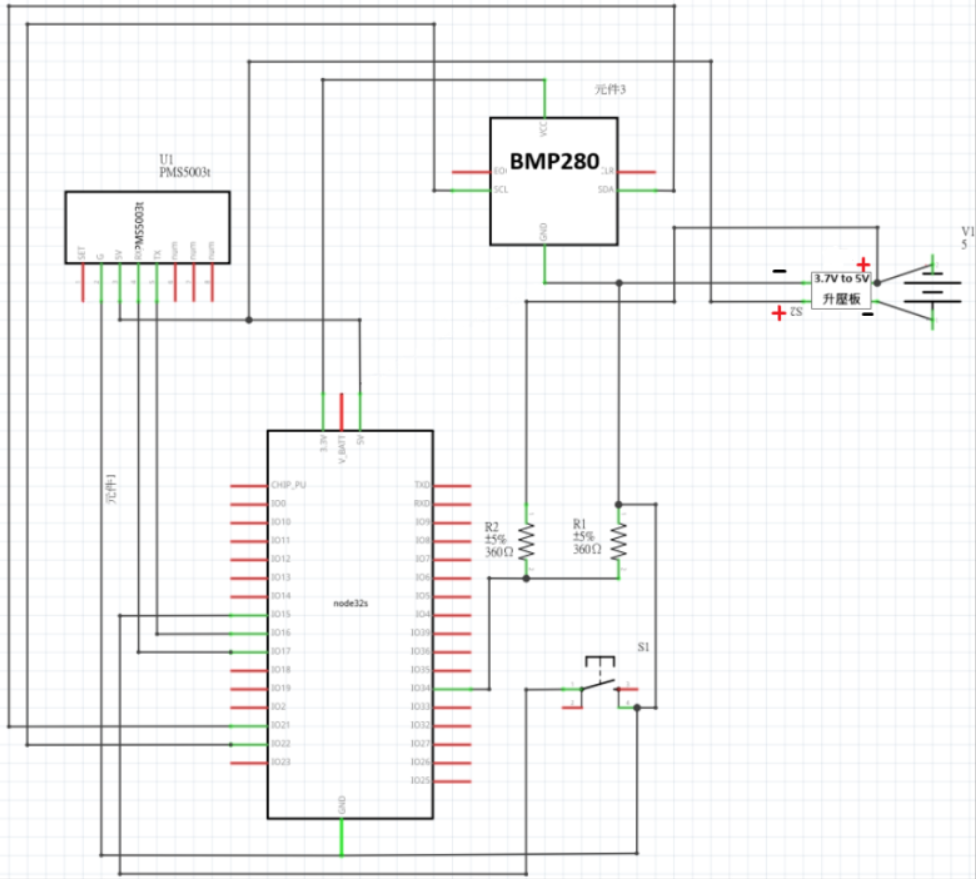

# 衛道中學氣象站-空氣盒子 VWS AirBox

[](https://www.codefactor.io/repository/github/daimapi/vws)


***基於esp32打造的空氣盒子***
[***氣象站 thingspeak 網站***](https://thingspeak.com/channels/2635834)

- [衛道中學氣象站-空氣盒子 VWS AirBox](#衛道中學氣象站-空氣盒子-vws-airbox)
  - [簡介 Introduction](#簡介-introduction)
  - [配備與細節 Specs](#配備與細節-specs)
    - [esp32 NodeMCU](#esp32-nodemcu)
    - [pms5003t](#pms5003t)
    - [BMP280](#bmp280)
    - [迷你DC-DC四段升壓板](#迷你dc-dc四段升壓板)
  - [佈線圖與引腳定義 Wiring Diagram and Pin Define](#佈線圖與引腳定義-wiring-diagram-and-pin-define)
  - [使用方法 How to use](#使用方法-how-to-use)
    - [設定](#設定)
    - [喚醒](#喚醒)
    - [讀取](#讀取)
    - [維護](#維護)

## 簡介 Introduction

- 具備測量 pm1、pm2.5、pm10、濕度、溫度、大氣壓儀器及本體鋰電池電壓監測

- 於每日世界協調時 00:00, 06:00, 12:00, 18:00 將資料上傳 thingspeak 資料庫

- 18650 鋰電池供電

## 配備與細節 Specs

- [esp32 NodeMCU-32s v1.3 ai-thinker](#esp32-nodemcu)
- [pms5003t](#pms5003t)
- [BMP280](#bmp280)
- [迷你DC-DC四段升壓板](#迷你dc-dc四段升壓板)
- 360K ohm 電阻 *2
- 按鈕、單/多芯線、杜邦線、電源插座(2.1mm)

### esp32 NodeMCU

- 空氣盒子**主控板**
- 屬性 :

    | 項目屬性 |    值    | 單位    |
    | :------- | :------: | :------ |
    | 工作電壓 | $$3.3$$  | $$V$$   |
    | WiFi頻段 | $$2.4$$  | $$GHz$$ |
    | 通訊鮑率 | $$9600$$ | $$bps$$ |

- [NodeMCU-32S 核心开发板](https://docs.ai-thinker.com/esp32/boards/nodemcu_32s)  
- [datasheet](https://docs.ai-thinker.com/_media/esp32/boards/nodemcu-32%E5%BC%80%E5%8F%91%E6%9D%BF%E8%A7%84%E6%A0%BC%E4%B9%A6v2.0.pdf)
  
### pms5003t

- **pm1**、**pm2.5**、**pm10**、**溫度**、**濕度**監測
- 使用UART交互接口
- *pms.sleep()* 下仍消耗不少電，成為 *deepsleep* 下的主要耗電者
- 機器端接口為2.0排針
- 屬性 :

    | 項目屬性 | 值(thingspeak上傳倍率) | 單位  |
    | :------- | :--------------------: | :---: |
    | 交互電壓 |          3.3           | $$V$$ |
    | 工作電壓 |           5            | $$V$$ |

- [攀藤 PMS5003T 粉塵溫濕度二合一感測器](https://shopee.tw/%E3%80%90%E6%A8%82%E6%84%8F%E5%89%B5%E5%AE%A2%E5%AE%98%E6%96%B9%E5%BA%97%E3%80%91%E3%80%8A%E9%99%84%E7%99%BC%E7%A5%A8%E3%80%8B%E6%94%80%E8%97%A4-PMS5003T-%E9%90%B3%E5%B0%84-PM2.5-%E9%AB%98%E7%B2%BE%E5%BA%A6-%E7%B2%89%E5%A1%B5%E5%8F%8A%E6%BA%AB%E6%BF%95%E5%BA%A6%E6%84%9F%E6%B8%AC%E5%99%A8-i.139069730.3663018719?sp_atk=4d2d7ed0-b116-4b6b-9138-57b2b704cc7e&xptdk=4d2d7ed0-b116-4b6b-9138-57b2b704cc7e)  
- [datasheet](http://file2.dzsc.com/product/20/07/06/975030_103959446.pdf)

### BMP280

- **溫度**、**氣壓**監測
- 使用I2C交互接口
- 屬性 :

    | 項目屬性 | 值(thingspeak上傳倍率) | 單位  |
    | :------- | :--------------------: | :---: |
    | 交互電壓 |          3.3           | $$V$$ |
    | 工作電壓 |          3.3           | $$V$$ |

- [BMP280-3.3高精度大氣壓感測器模組](https://shopee.tw/BMP280-3.3%E9%AB%98%E7%B2%BE%E5%BA%A6%E5%A4%A7%E6%B0%A3%E5%A3%93%E6%84%9F%E6%B8%AC%E5%99%A8%E6%A8%A1%E7%B5%84-%E9%AB%98%E5%BA%A6%E8%A8%88%E5%A4%A7%E6%B0%A3%E5%A3%93%E5%BC%B7%E5%BA%A6%E5%82%B3%E6%84%9F%E5%99%A8%E9%81%A9%E7%94%A8Arduino%E6%A8%B9%E8%8E%93%E6%B4%BE%E5%8F%8AMCU%E9%96%8B%E7%99%BC%E6%9D%BF-i.4491023.3800722257)  
- [datasheet](https://5.imimg.com/data5/SELLER/Doc/2022/1/WG/FV/GY/1833510/gy-bmp280-3-3-high-precision-atmospheric-pressure-sensor.pdf)

### 迷你DC-DC四段升壓板

- 鋰電池供電模組
- 使用5V(開開)降壓模式
- 鋰電池沒電(輸入低於 2.5V 時)時自動切斷
- 屬性 :

    | 項目屬性       |   值    |  單位  |
    | :------------- | :-----: | :----: |
    | 輸入電壓範圍   | 2.5 ~ 5 | $$V$$  |
    | 輸出電流       |    1    | $$A$$  |
    | 輸出電壓(設為) |    5    | $$V$$  |
    | 空載輸入端電流 |    1    | $$mA$$ |

- [迷你DC-DC四段升壓板](https://jin-hua.com.tw/webc/html/product/show.aspx?num=33588&page=1&kind=3310)

## 佈線圖與引腳定義 Wiring Diagram and Pin Define




| 麵包板號 | 項目屬性      |    esp32-pin     |   設備    |     設備-pin     |
| :------: | :------------ | :--------------: | :-------: | :--------------: |
|    30    | bmp280供電    |       3V3        |  bmp280   |       VCC        |
|    26    | 電壓監測      |      GPIO34      | 360kohm*2 | 麵包板上排負極軌 |
|    17    | PMS5003t接地  |       GND        | PMS5003t  |       GND        |
|    12    | esp32供電     |     VIN(5V)      |  升壓板   |       +5V        |
|    15    | 外部喚醒接口  |      GPIO15      | 按鈕(s1)  | 麵包板下排正極軌 |
|    19    | PMS5003t UART |   GPIO16 (RX2)   | PMS5003t  |        TX        |
|    20    | PMS5003t UART |   GPIO17 (TX2)   | PMS5003t  |        RX        |
|    24    | esp32接地     |       GND        |  升壓板   | 麵包板上排負極軌 |
|    25    | bmp280 SDA    | GPIO21 (I2C-SDA) |  bmp280   |       SDA        |
|    28    | bmp280 SCL    | GPIO22 (I2C-SCL) |  bmp280   |       SCL        |
|    30    | bmp280 接地   |       GND        |  bmp280   |       GND        |

## 使用方法 How to use

### 設定

- 程式內未含token.h標頭檔，請自行創建txt檔複製以下文字，填入各項資訊並將檔名改為token.h，否則程式將出現編譯錯誤。

    ```cpp
    #define CHANNEL_ID 1231233                       // ur channel id
    #define CHANNEL_WRITE_API_KEY "KKKKKKKKKKKK"     // ur CHANNEL_WRITE_API_KEY
    #define ssid "213123"                            // ur ssid
    #define pw ""                                    // ur password (沒有就填"")
    ```

- 插入一個電池電壓大於2.5V的18650電池，以 2.1mm DC 電源插頭連接

### 喚醒

- 喚醒方式分為以下三種：

    1. 硬體重置(CPU & RTC reset)：

        - 第一次上電，或按下 EN 鈕時觸發

        - 觸發時啟動各硬體並聯網，擷取數據並同步RTC時鐘，但不傳送資料

    2. RTC時鐘喚醒：

        - 於每日世界協調時 00:00, 06:00, 12:00, 18:00 (即台灣時間 02:00, 08:00, 14:00, 20:00 ) 自動喚醒

        - 觸發時啟動各硬體並聯網，擷取數據並傳送資料，但只於 01:00 ~ 02:59同步RTC時鐘

    3. 外部喚醒：

        - 觸發時啟動各硬體並聯網，擷取數據並同步RTC時鐘，傳送資料

    喚醒後啟動 PMS5003t 及 bmp280 並讀取電池電壓，連線後等待 PMS5003t 風扇運轉滿 30 秒並讀取數據，上傳後同步RTC時鐘再進入深度睡眠等待下次時鐘喚醒

- 喚醒時將嘗試連線200秒，如無法連接則將跳過所有需要網路的工作( RTC 同步、傳送資料到 thngspeak 等)

### 讀取

- 上傳至 thingspeak 網站，以折線圖標示

- 部分資料單位倍率如下：  
  
    | 項目屬性 | 值(thingspeak上傳倍率) |      單位      |
    | :------- | :--------------------: | :------------: |
    | 氣壓     |  $$\times{10^{-1}}$$   |    $$hpa$$     |
    | 溫度     |  $$\times{10^{-1}}$$   | $$\degree{C}$$ |
    | 空氣品質 |     $$\times{1}$$      | $$\mu{g/m^3}$$ |
    | 濕度     |  $$\times{10^{-1}}$$   |     $$\%$$     |
    | 電池電壓 |  $$\times{10^{-1}}$$   |     $$V$$      |

### 維護

- 主控板上的 micro USB 接口已經插了一條 USB 線，即通訊介面為 USB-A 公頭，連接手機後可用 USB terminal app 監控設備狀況，連接 Arduino IDE 亦可上傳程式

- 鋰電池輸出電壓範圍在 2.7 到 4.2V 間，升壓板最低輸入電壓為 2.5V，應在鋰電池電壓低於 2.7V 時更換並充電，以免造成過放
